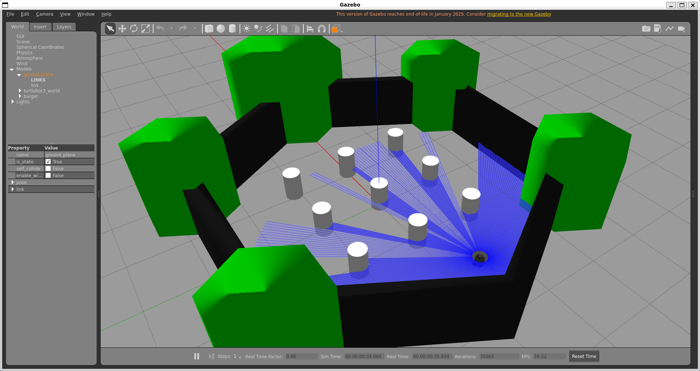

# 01 — Introduction & Environment Setup

Prerequisites, Docker setup, and a clean build for reproducing this
project's environment.

## What this project is

A simulated TurtleBot3 Burger operating in a custom warehouse environment —
reactive obstacle avoidance, SLAM mapping, and autonomous Nav2 waypoint
navigation — built on ROS2 Humble and Gazebo Classic, in a Docker container
on WSL2.

## Stack

| Component | Choice |
|---|---|
| OS | Windows 10/11 + WSL2 (Ubuntu) |
| ROS2 distro | Humble |
| Simulator | Gazebo Classic (`gazebo-ros-pkgs`) |
| Robot | TurtleBot3 Burger (simulated) |
| Container | built from `docker/Dockerfile` (ROBOTIS's official Humble image) |
| Custom world | `warehouse_world.sdf`|

---

## Prerequisites

- WSL2 with Ubuntu 22.04
- Intel or AMD processor (with x64 processor architecture). This is the reason why the Docker container won't work 
directly for example on Apple Silicon, Raspberry or Jetson platforms.
- A computer with sufficient processing power to run Gazebo simulation smoothly.
- [Docker](https://docs.docker.com/engine/install/ubuntu/). Follow the link for the official tutorial
and the latest installation instructions.
- Git (`sudo apt install git`)

---

## 1. Clone this repository
In WSL
```bash
cd ~
git clone git@github.com:mahdi-yousef/ROS2_Turtlebot3.git
cd ROS2_Turtlebot3
```

## 2. Build the base image

`docker/Dockerfile` is ROBOTIS's official TurtleBot3 Humble Dockerfile
(source: [`github.com/ROBOTIS-GIT/turtlebot3/tree/humble/docker/humble`](https://github.com/ROBOTIS-GIT/turtlebot3/tree/humble/docker/humble)),
included in this repo unmodified. It clones and builds the `turtlebot3`
package itself at build time — no separate clone of that repo is needed.

Build the image:
```bash
cd docker
docker build -t robotis/turtlebot3:humble .
```

This installs ROS2 Humble desktop, Cartographer, Nav2, and hardware driver
packages, and takes several minutes. It does **not** include any Gazebo or
simulation packages — those are added in step 6.

## 3. Set up persistent storage

The container only keeps what's explicitly bind-mounted from the host —
anything built only *inside* the container is lost if the container is
destroyed (`docker compose down`).

```bash
mkdir -p ~/tb3_extra/turtlebot3_simulations
```

> If this fails with "Permission denied" (Docker may have auto-created the
> parent folder as root on an earlier run):
> ```bash
> sudo chown -R $USER:$USER ~/tb3_extra
> mkdir -p ~/tb3_extra/turtlebot3_simulations
> ```

## 4. docker-compose.yml

You can see in `docker/` the following yaml file:
```yaml
services:
  turtlebot3:
    container_name: turtlebot3
    image: robotis/turtlebot3:humble
    tty: true
    restart: unless-stopped
    cap_add:
      - SYS_NICE
    ulimits:
      rtprio: 99
      rttime: -1
      memlock: 8428281856
    network_mode: host
    ipc: host
    pid: host
    environment:
     - DISPLAY=${DISPLAY}
     - QT_X11_NO_MITSHM=1
    volumes:
      - /dev:/dev
      - /dev/shm:/dev/shm
      - /run/udev:/run/udev
      - /tmp/.X11-unix:/tmp/.X11-unix:rw
      - /tmp/.docker.xauth:/tmp/.docker.xauth:rw
      - ~/tb3_extra/turtlebot3_simulations:/root/turtlebot3_ws/src/turtlebot3_simulations
      - ../src/custom_packages:/root/turtlebot3_ws/src/custom_packages
    privileged: true
    command: bash
```

Two mounts matter:
- `~/tb3_extra/turtlebot3_simulations` (host, outside the repo) →
  `turtlebot3_simulations`, ROBOTIS's Gazebo simulation packages, added in
  step 6.
- `../src/custom_packages` (this repo's own `src/custom_packages/`, sibling
  to `docker/`) → my project's own packages created by me using turtle nest (`my_robot_control`,
  `my_robot_bringup`). No separate setup needed for this one — it's part of
  the repo and mounts automatically on clone.

Start the container then open a terminal in it as follows:
```bash
docker compose up -d
docker exec -it turtlebot3 bash
```

> In WSL use `docker stop turtlebot3` to stop the container. Avoid using `docker compose down` so you don't destroy the container and lose built progress.

## 5. Confirm the environment

```bash
source ~/.bashrc
echo $ROS_DISTRO
echo $TURTLEBOT3_MODEL
```
Should print 
```
humble
burger
```

## 6. Add Gazebo simulation support

```bash
cd ~/turtlebot3_ws/src
git clone -b humble https://github.com/ROBOTIS-GIT/turtlebot3_simulations.git turtlebot3_simulations
```

## 7. Install dependencies and build

```bash
apt-get update
cd ~/turtlebot3_ws
rosdep update
rosdep install --from-paths src --ignore-src -r -y
```

```bash
MAKEFLAGS="-j2" colcon build --symlink-install --parallel-workers 1
source install/setup.bash
```
> `1 package failed: turtlebot3_simulations` with everything else
> succeeding — it's an empty metapackage referencing
> `turtlebot3_manipulation_gazebo` (arm variant, not built here). Safe to
> ignore.
>
> `my_robot_bringup` fails with `Check that the following packages have
> been built: - my_robot_control` — dependency ordering; this one-shot
> full build already handles it correctly. If rebuilding a single package
> later, use `colcon build --packages-up-to my_robot_bringup` instead of
> `--packages-select`.

## 8. Verify

```bash
ros2 launch turtlebot3_gazebo turtlebot3_world.launch.py
```
This must open the standard world file that comes with the turtlebot3_gazebo package `~/turtlebot3_ws/src/turtlebot3_simulations/turtlebot3_gazebo/worlds/turtlebot3_world.world`as shown below:

> Robot not visible in Gazebo — confirm `echo $TURTLEBOT3_MODEL`, then
> check Gazebo's Models panel and right-click the robot entry → Follow.
> If that doesn't resolve it, in WSL `docker restart turtlebot3` and relaunch.

Gazebo should open (via WSLg, no extra X server setup needed) showing the
warehouse with TurtleBot3 spawned inside it. See folders `02` through `04`
for the rest of the project once this is confirmed working.

## 9. Opening a new terminal inside the container

To create a shortcut for running the container and/or opening a new terminal inside it, open WSL then:
```bash
nano ~/.bashrc
```
then navigate to the bottom of the file and paste the following:
```bash
tb3() {
    cd ~/ROS2_Turtlebot3/docker || return

    docker compose up -d

    docker exec -it turtlebot3 bash
}
```
then press ctrl+x then press y then ENTER. Now in WSL:
```bash
source ~/.bashrc
```
As a result, whether you've ran the container or not, to open a new terminal in it simply type in any WSL terminal:
```bash
tb3
```

## Repository Layout Reference

```
ROS2_Turtlebot3/
├── 01-introduction/
├── 02-turtlebot3_nodes/
├── 03-slam and navigation/
├── 04-custom_nodes/
├── docker/
│   ├── Dockerfile              # ROBOTIS's official Dockerfile (unmodified)
│   └── docker-compose.yml
└── src/
    └── custom_packages/
        ├── my_robot_control/    # obstacle_avoider, waypoint_follower
        └── my_robot_bringup/    # launch files, config, worlds, maps
```
