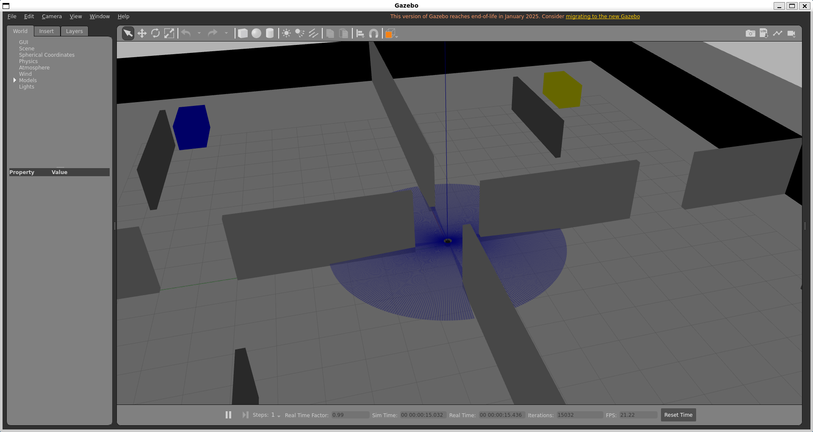
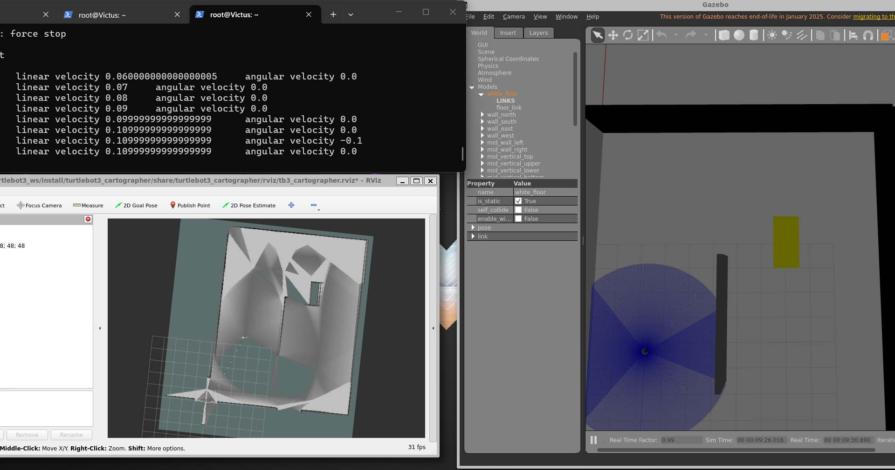
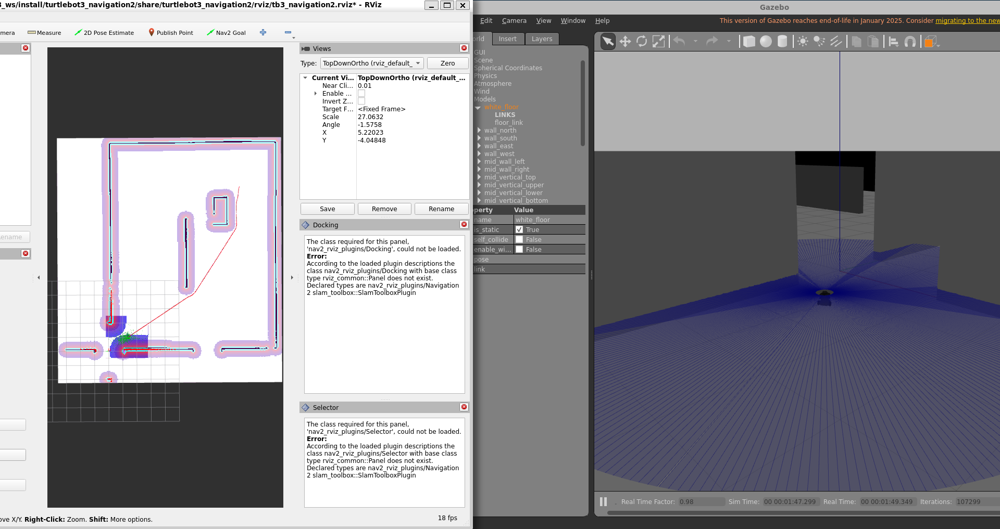
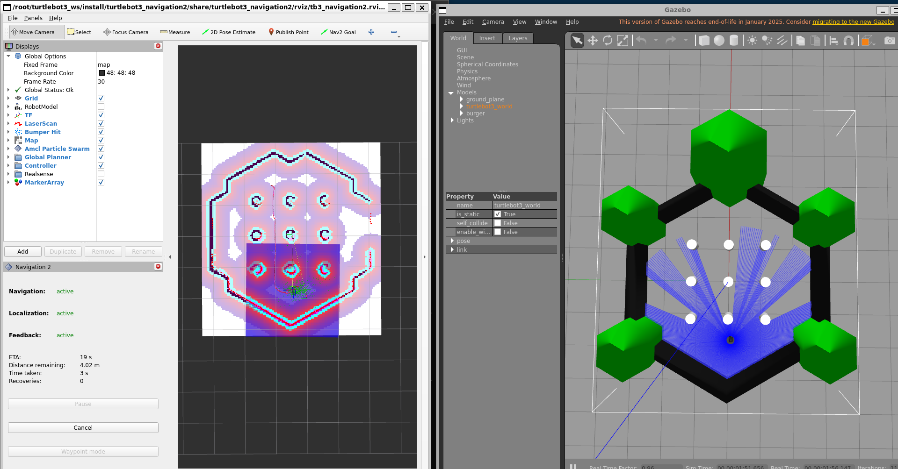

# 03 - SLAM and Navigation

This folder covers the SLAM and Nav2 workflow, using the launch files I built in `my_robot_bringup`.

## Launch files

Location: `src/custom_packages/my_robot_bringup/launch/`

- **`custom_world_demo.launch.py`**: spawns TurtleBot3 in the warehouse world. This is the building block the other two include. Same structure as ROBOTIS's turtlebot3_world.launch.py (gzserver + gzclient +
robot_state_publisher + spawn_turtlebot3), but the world file is a launch
argument instead of hardcoded -- point it at any .sdf world file you've placed
in this package's worlds/ folder (or anywhere else on disk).
- **`slam_demo.launch.py`**: includes `custom_world_demo.launch.py`, then adds `turtlebot3_cartographer` for mapping and opens RViz.
- **`nav_demo.launch.py`**: includes `custom_world_demo.launch.py`, then adds `turtlebot3_navigation2` against a saved map and opens RViz.

I built them this way, one launch file including smaller ones, so the world spawn logic isn't duplicated across SLAM and navigation.

---

## custom_world_demo.launch.py
First run the container and open a new terminal in it as described in [section 02](../02-turtlebot3_nodes/README.md#used-in-simulation).

`warehouse_world.sdf` (in `src/custom_packages/my_robot_bringup/worlds/`)
was downloaded from: **[https://app.gazebosim.org/hboc/worlds/simple_colored_warehouse]**. It contains no external model references (self-contained
world file, no separate `models/` folder needed). You can launch it in gazebo and spawn turtlebot3 burger agent in it using `custom_world_demo.launch.py`as follows:
```bash
ros2 launch my_robot_bringup custom_world_demo.launch.py
```
The default arguments are:

- `world:=/root/turtlebot3_ws/install/my_robot_bringup/share/my_robot_bringup/worlds/warehouse_world.sdf`
- `x_pose:=0.0`
- `y_pose:=0.0`
  

---
or you can launch in any world (.world/.sdf) using the following arguments for example:
```bash
ros2 launch my_robot_bringup custom_world_demo.launch.py \
    world:=/root/turtlebot3_ws/src/turtlebot3_simulations/turtlebot3_gazebo/worlds/turtlebot3_world.world \
    x_pose:=-2.0 \
    y_pose:=-0.5
```
## slam_demo.launch.py

You need two terminals into the same container.

**Terminal 1:**
```bash
ros2 launch my_robot_bringup slam_demo.launch.py
```
The default arguments are:

- `world:=/root/turtlebot3_ws/install/my_robot_bringup/share/my_robot_bringup/worlds/warehouse_world.sdf`
- `x_pose:=0.0`
- `y_pose:=0.0`
  
Gazebo and RViz should open, with the map building live in RViz as you drive.

**Terminal 2** (open a new terminal in the container):
```bash
ros2 run turtlebot3_teleop teleop_keyboard
```
Drive slowly, especially through turns, and try to loop back to your start point so Cartographer gets a clean loop closure.



Once the map looks good, save it:
```bash
ros2 run nav2_map_server map_saver_cli -f ~/turtlebot3_ws/src/custom_packages/my_robot_bringup/maps/map_name
```
also you can launch in any world (.world/.sdf) and SLAM using the following arguments for example:
```bash
ros2 launch my_robot_bringup slam_demo.launch.py \
  world:=/root/turtlebot3_ws/src/turtlebot3_simulations/turtlebot3_gazebo/worlds/turtlebot3_world.world \
  x_pose:=-2.0 \
  y_pose:=-0.5
```
In this repo, I included SLAM maps for warehouse_world and turtlebot3_world, which you can use later in navigation directly, at the following directory `/root/turtlebot3_ws/src/custom_packages/my_robot_bringup/maps` of respective names:

- `warehouse_map.yaml`
- `tb3world_map.yaml`

---

## nav_demo.launch.py

Open a new terminal inside the container as described before then:
```bash
ros2 launch my_robot_bringup nav_demo.launch.py
```
The default arguments are:

- `world:=/root/turtlebot3_ws/install/my_robot_bringup/share/my_robot_bringup/worlds/warehouse_world.sdf`
- `map:/root/turtlebot3_ws/install/my_robot_bringup/share/my_robot_bringup/maps/warehouse_map.yaml`
- `x_pose:=0.0`
- `y_pose:=0.0`

In RViz, click "2D Pose Estimate" and click-drag on the robot's real position and heading on hte map. Then click on "Nav2 Goal" and click-drag on the map to send goal position and heading for the burger bot.



also you can launch in any world with its map using the following arguments for example:
```bash
    ros2 launch my_robot_bringup nav_demo.launch.py \
        world:=/root/turtlebot3_ws/src/turtlebot3_simulations/turtlebot3_gazebo/worlds/turtlebot3_world.world \
        map:=/root/turtlebot3_ws/src/custom_packages/my_robot_bringup/maps/tb3world_map.yaml \
        x_pose:=-2.0 \
        y_pose:=-0.5
```



---
