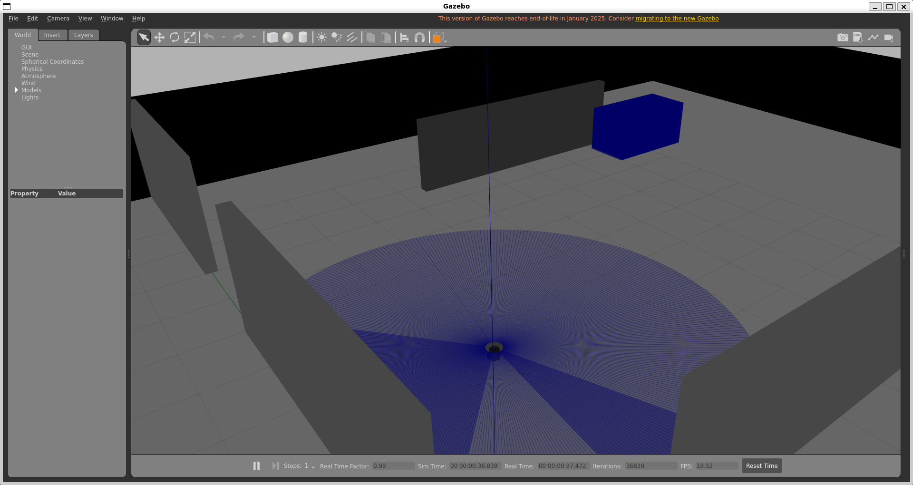
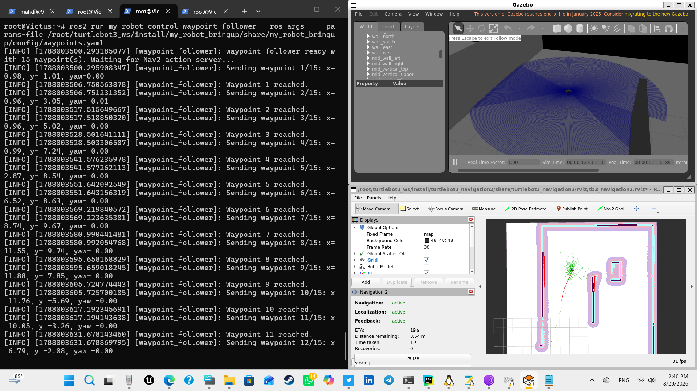

# 04 - Custom Nodes

The two nodes I wrote for this project, both in `src/custom_packages/my_robot_control/my_robot_control/`.

## obstacle_avoider

Reactive, LiDAR-based obstacle avoidance. Looks at a forward cone of the `/scan` topic, drives forward if nothing's within `stop_distance`, otherwise stops and turns toward whichever side has more open space.

Configured via a parameter YAML rather than hardcoded values, see the explanation above for how that mechanism works. Defaults:

| Parameter | Default | Meaning |
|---|---|---|
| `stop_distance` | 0.45 m | Start turning when something is closer than this |
| `forward_speed` | 0.15 m/s | Straight-line driving speed |
| `turn_speed` | 0.6 rad/s | Turning speed when avoiding |
| `forward_cone_deg` | 40.0° | +/- degrees around straight-ahead counted as "front" |

**Run it:**
```bash
ros2 launch my_robot_bringup avoid_demo.launch.py
```
Gazebo opens with the robot driving itself around the warehouse, stopping and turning away from shelves and walls.

**Override the tuning**, either edit `config/obstacle_avoider_params.yaml` directly, point at a different YAML entirely:
```bash
ros2 launch my_robot_bringup avoid_demo.launch.py \
  params_file:=/path/to/your_own_params.yaml
```
or override a single value on the command line:
```bash
ros2 launch my_robot_bringup avoid_demo.launch.py --ros-args -p stop_distance:=0.6
```



---

## waypoint_follower

Sends a sequence of `(x, y, yaw)` goals to Nav2's `NavigateToPose` action, one at a time, waiting for each to finish before sending the next. Waits for AMCL to publish a localized pose before sending anything, so it's safe to start even before you've given a 2D Pose Estimate, it just sits and waits.

Waypoints come from `config/waypoints.yaml`, same YAML-parameter pattern as `obstacle_avoider`, edit real `(x, y, yaw)` values there by reading coordinates off your saved map in RViz.

**`nav_demo.launch.py` no longer starts this automatically** (removed to keep Nav2 usable on its own while tuning localization, without a mission firing off goals in the background). Run it yourself in a second terminal instead:

**Terminal 1:**
```bash
ros2 launch my_robot_bringup nav_demo.launch.py
```
Give a 2D Pose Estimate in RViz once it's up.

**Terminal 2:**
```bash
ros2 run my_robot_control waypoint_follower --ros-args \
  --params-file /root/turtlebot3_ws/install/my_robot_bringup/share/my_robot_bringup/config/waypoints.yaml
```

Watch the terminal, it logs one line per waypoint sent and one per result:
```
[waypoint_follower]: waypoint_follower waiting for AMCL localization (give a "2D Pose Estimate" in RViz)...
[waypoint_follower]: AMCL pose received -- starting waypoint mission.
[waypoint_follower]: Sending waypoint 1/3: x=1.00, y=0.00, yaw=0.00
[waypoint_follower]: Waypoint 1 reached.
```



---

## Both together

Nothing stops you running `obstacle_avoider` for casual driving and `waypoint_follower` for scripted missions in the same session, just not at the same time, both publish to `/cmd_vel` and would fight each other.
