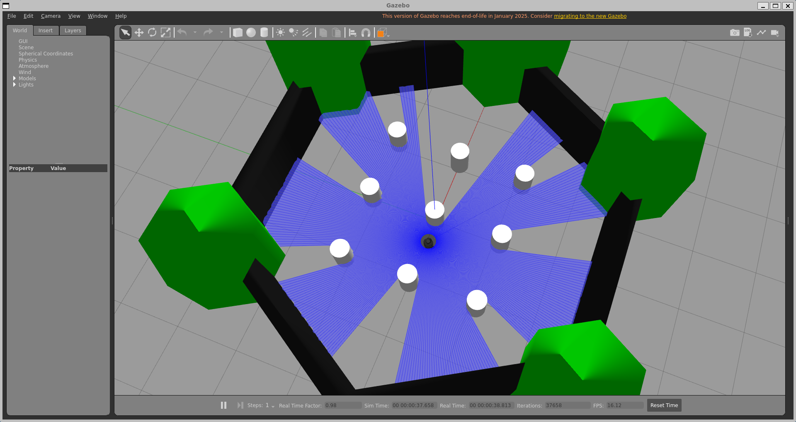

# 04 - Custom Nodes

The two nodes I wrote for this project, both in `src/custom_packages/my_robot_control/my_robot_control/`.

## obstacle_avoider

Reactive, LiDAR-based obstacle avoidance. Looks at a forward cone of the `/scan` topic, drives forward if nothing's within `stop_distance`, otherwise stops and turns toward whichever side has more open space.

Configured via a parameter YAML rather than hardcoded values. Default parameter file `obstacle_avoider_params.yaml` values:

| Parameter | Default | Meaning |
|---|---|---|
| `stop_distance` | 0.45 m | Start turning when something is closer than this |
| `forward_speed` | 0.15 m/s | Straight-line driving speed |
| `turn_speed` | 0.6 rad/s | Turning speed when avoiding |
| `forward_cone_deg` | 40.0° | +/- degrees around straight-ahead counted as "front" |

**The node should be initiated while gazebo is launched and the turtlebot is spawned inside a world, then a launch file `avoid_demo.launch.py` is created for this purpose. Run it:**
```bash
ros2 launch my_robot_bringup avoid_demo.launch.py
```
The default arguments are:

- `world:=/root/turtlebot3_ws/install/my_robot_bringup/share/my_robot_bringup/worlds/warehouse_world.sdf`
- `x_pose:=0.0`
- `y_pose:=0.0`
- `params_file:=/root/turtlebot3_ws/install/my_robot_bringup/share/my_robot_bringup/config/obstacle_avoider_params.yaml`

Gazebo opens with the robot driving itself around the warehouse, stopping and turning away from blocks and walls.


**Override the tuning**, either edit `config/obstacle_avoider_params.yaml` directly, or point at a different YAML entirely:
```bash
ros2 launch my_robot_bringup avoid_demo.launch.py \
  params_file:=/path/to/your_own_params.yaml
```
or override a single value on the command line:
```bash
ros2 launch my_robot_bringup avoid_demo.launch.py --ros-args -p stop_distance:=0.6
```
Finally, you can specify your arguments to any world and parameter file as follows:
```bash
ros2 launch my_robot_bringup avoid_demo.launch.py \
  world:=/root/turtlebot3_ws/src/turtlebot3_simulations/turtlebot3_gazebo/worlds/turtlebot3_world.world \
  params_file:=/root/turtlebot3_ws/install/my_robot_bringup/share/my_robot_bringup/config/custom_avoid_param.yaml \
  x_pose:=-2.0 \
  y_pose:=-0.5
```


---

## waypoint_follower

Sends a sequence of `(x, y, yaw)` goals to Nav2's `NavigateToPose` action, one at a time, waiting for each to finish before sending the next. Waits for AMCL to publish a localized pose before sending anything, so it's safe to start even before you've given a 2D Pose Estimate, it just sits and waits.

Waypoints come from `/root/turtlebot3_ws/install/my_robot_bringup/share/my_robot_bringup/config/waypoints.yaml`, same YAML-parameter pattern as `obstacle_avoider`, which I included and already filled with coordinates and ready to try.

**Incase you don't want to custom make your waypoints, skip this part and proceed to section Yaw tolerance. Get real `(x, y)` values off the map**, instead of eyeballing coordinates, use RViz's **Publish Point** tool:
1. With `nav_demo.launch.py` running and the map loaded in RViz, the **Publish Point** button in the RViz toolbar will publish a `geometry_msgs/PointStamped` to the `/clicked_point` topic.
2. In a new terminal, echo that topic to read off the coordinates as you click:
   ```bash
   ros2 topic echo /clicked_point
   ```
3. Click anywhere on the map at the locations you want as a waypoints to construct your trajectory.

4. Copy the `x`, `y` values from the echoed output into `config/waypoints.yaml` and for yaw values, fill with random values (`z` values for example, see following section for explanation). Alternatively, create new yaml file of the same format and pass it as an argument instead of `waypoints.yaml` as described later.

### Yaw tolerance
For yaw values, we filled with random values as we will disregard it to ensure smooth transition between waypoints and prevent halting at each reached (x,y) coordinate to adjust heading by `NavigateToPose` action. This can be achieved by increasing `yaw_goal_tolerence` to `6.283`~(`2π`) to accept whatever value of heading the robot reaches the waypoint with.


To edit `yaw_goal_tolerence`:
```bash
nano /root/turtlebot3_ws/install/turtlebot3_navigation2/share/turtlebot3_navigation2/param/humble/burger.yaml
```
scroll to this part:
```bash
    general_goal_checker:
      stateful: True
      plugin: "nav2_controller::SimpleGoalChecker"
      xy_goal_tolerance: 0.25
      yaw_goal_tolerance: 0.25
```
edit `yaw_goal_tolerence` to 6.283 then press ctrl+x then press y then ENTER.

**Note**: remember to edit this value back to 0.25 after you finish this application since its used by all other navigation applications through `turtlebot3_navigation2` node.

**Terminal 1:**
```bash
ros2 launch my_robot_bringup nav_demo.launch.py
```
Give a 2D Pose Estimate at the turtlebot position in RViz once it's up.

**Terminal 2:**
```bash
ros2 run my_robot_control waypoint_follower --ros-args \
  --params-file /root/turtlebot3_ws/install/my_robot_bringup/share/my_robot_bringup/config/waypoints.yaml
```

Watch the terminal, it logs one line per waypoint sent and one per result:
```
[waypoint_follower]: waypoint_follower waiting for AMCL localization (give a "2D Pose Estimate" in RViz)...
[waypoint_follower]: AMCL pose received -- starting waypoint mission.
[waypoint_follower]: Sending waypoint 1/3: x=1.00, y=0.00, yaw=0.00
[waypoint_follower]: Waypoint 1 reached.
```


---

